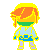

# Frozen!

冻结！ 

## 前言

开发者：Sirius

协助开发者：Val Thalas（bgm以及主角的绘图）

它仍在被开发中，目前已发现的bug：

- 有时与物品的互动无效
- 音频文件暂时无法播放

## 概要

这是一个基于 QT5 开发的简陋的生存游戏，

**游戏目的**：活下去，当你的**生命值 HP**降到 **0即以下** 时，你输掉游戏

**游戏界面**：

- 方格棋盘就是你的游戏界面，游戏中所有物品均占一格

- 你控制那个形似林克的主人公，移动方式是一格一格的

- 你的脸有四个朝向，在你的脸朝向前方会有个**目标框**，表示你行为的目标位置

- 右侧的一栏显示你当前的信息，

  其中最上方表示**当前准备合成的物品**，标红表示你缺少这个原料

  中间为你的一些指标，包括生命值、饱食度，持有的一些原料数量，当前的世界（用一个时钟表示），以及主人公的状态

- 下方为当前目标框中的物品

**操作指南**：

- **W S A D** 代表四个方向的移动

- **Z** 为互动键，

  当目标框是一个空地或是一些可拾取物品时，按Z会试图放置或消耗当前准备合成的物品；

  否则，会试图与物品互动。

- **X** 为拆除键，当目标框中是一个**你建造的物品**时，会将它拆除，不会返还原料

- **A S** 为滚轮键，会切换当前准备合成的物品

- **I J K L** 为转头键，表示只改变脸的朝向，不移动，适合一些精细的摆放

## 机制

**时间机制：** 

游戏的时间会不断流逝，当时钟转满一圈时会度过**一天**。每10天会更换一次**季节**。

本游戏共有两个季节：**温季，寒季**

- 两个季节各自都有季节专属的产生物
- 寒季的**猎狗**与**轰炸袭击**会有不同
- 寒季的植物生长时间减半

当季节变化时，时钟的样式、地图的颜色也会改变，这可以判断当前季节的手段

此外，每过一定时间游戏地图上会发生随机事件

**饥饿机制：**

作为一款生存游戏，你的**饱食度 Hunger**会不断消耗，并且随着时间增长越来越快

当你的饱食度降到 **0即以下** 时，你将不再失去饱食度，取而代之，你进入**饥饿状态**

所以请务必随时注意你的饱食度情况

**人物状态机制**：

共有四种人物状态：

 **正常**：一个小绿脸，表示你当前正在正常进行游戏

 **饥饿**：一个小橙脸，此时会不断**损失生命值**

 **无敌**：彩色的脸，此时你免疫一切**生命值、饱食度下降**的事件

 **暂停**：游戏暂停，一切事物停止计算

 **死亡**：游戏结束了，重开吧

## 百科

这里介绍本游戏的所有**对象（Object）**，按照类别逐条介绍。

#### 1、生物

 **玩家 Player** ：**HP 10，Hunger 50** （初始）

​			  这就是你在地图上的样子

 **无敌玩家 Invincible Player** 这标志着你进入了 “无敌状态”

  **猎狗 Doggy**：**HP 5**

​									一个敌对生物，会以一定的速度**沿最短路**追击着你，当无法找到你时会**随机游走**

​									**撕咬**：得益于它锋利的牙齿，它的近身攻击能造成 **5HP/下** 的伤害

  **冬季猎狗 SnowDoggy**：**HP 5**

​									寒季的猎狗。特别地，它们移动时会留下**冰**

 **冬王 WinterKing**：**HP 30**

​									BOSS级敌对生物。沉睡在这片大陆的冰封国王

​									出场位置会有骷髅标志和长达2秒的黄色警报，移动速度较慢，也会不断接近玩家

​									**冰封剑**：他提着霜之哀伤向你砍去，能造成 **20HP/下** 的高额伤害

​									**深蓝色环：**始终会有以他为中心的 3x3 的**冰**护卫着它们的国王

​									**[特殊攻击] 极地响尾蛇**：如果它与玩家当前存在通路，会出现一条从它开始，目标为玩家的**黄色通路**。

​									如果它抵达玩家，会造成 **7HP/下** 的伤害。同时沿途会留下**冰**

#### 2、可拾取物

*以下只在温季产生*

 **苹果 Apple**：拾取后 **Hunger+10**

 **兔子 Rabbit**：拾取后 **HP+1, Hunger+50**

 **金苹果 GApple**：拾取后会暂存在**原料栏**中（**GApple+1**）

​						                     可以通过滚轮切到金苹果合成画面按Z，消耗一个食用

​											 食用后 **Hunger+100**

 **普通树种 Seed**：拾取后 **Seed+1**

*以下只在寒季产生*

 **冰 Ice**：真是讨厌。拾取后 **HP-1，Hunger-20**

 **王冠 Crown**：成为这个世界的王！拾取后进入无敌状态

 **黄金树种 GSeed**：拾取后 **GSeed+1**

*以下两季均可产生*

 **材料包 Material**：合成许多建筑物的基础，拾取后 **Material+10

 **心 Heart**：拾取后 **HP+3**

**金心 GHeart** ：拾取后 **HP*2** 

 **奇异果 AlienFruit**：拾取后 **HP+8，Hunger-100**

​												  PS：无法自然产生，只能由激光照射**金苹果**得到。可阻挡激光

#### 3、危险机关

 **十字炸弹 CrossBomb**：随机生成，爆炸范围是一个十字，伤害 **3HP**

​														是你在这个世界感受到的第一个恶意

    

**激光 Laser**：你可以看到地图右侧有一栏格子，当其为**安全**时，表示暂时这一行没有危险；

​                       为**警告**时，表示即将会有一束激光袭来；为**发射**时，会有一束高能激光清扫这一行

​                       伤害 **5HP**

​						激光会**激活**沿途的可激活建筑物

 **轰炸袭击 The Fear**：一个瞄准标志，随后以其为中心引发 5x5 的爆炸，爆炸伤害 **10HP**

 **暴风雪 The Snowstorm**：寒季的轰炸袭击，会在爆炸后留下**冰**，其它一致

#### 4、可放置物

 **树 Tree**：消耗 **Seed*1**

​							    可阻挡激光，会被摧毁。周期性地在上下左右四个相邻格子产生**苹果**

 **黄金树 GTree**：消耗 **GSeed*1**

​                                           可阻挡激光，会被摧毁。周期性地在上下左右四个相邻格子产生**金苹果**

    

**墙 Wall**：消耗 **Material*2**

普通状态可阻挡激光，透明状态不可阻挡激光，不会被摧毁

透明状态可激活

对其**互动**：可切换其是否透明

  

**门 Door**：消耗 **Material*1**

开启状态允许生物通过，关闭状态不允许

可阻挡激光，不会被摧毁

对其**互动**：可切换其开关状态，

  

**地毯 Carpet**：消耗 **Material*1**

允许生物通过

普通状态可阻挡激光，透明状态不可阻挡激光，会被摧毁

透明状态可激活

对其**互动**：可切换其是否透明

 

**能量塔 Pylon**：消耗 **Material*10**

可阻挡激光，不会被摧毁，可激活

**被激活**：如果它的上下左右有**可激活物**，会激活并在沿途产生紫色的**激光**

​			   会优先激活寻求到的**优先状态的能量塔**

对其**互动**：可切换其是否为**优先状态**

 

**电池 Cell**：消耗 **Material*5, GApple\*1**

可阻挡激光，不会被摧毁，可激活

**被激活**：储存能量，直到被**互动**

对其**互动**：释放其中的能量，往互动者的面朝方向射出一道紫色的**激光**

 

**人造树 PTree**：消耗 **Seed*5， Material\*20**

可阻挡激光，不会被摧毁，可激活

**被激活**：在上下左右四个相邻格子产生**苹果**

 

**引擎 Motor**：消耗 **Material*10**

可阻挡激光，不会被摧毁，可激活

将激光能转化为机械能的奇妙装置

**被激活**：对上下左右四个相邻格子的对象**互动**一次

 

**黄金叶**：**消耗 **Seed*3，GSeed\*1，Material\*10**

可阻挡激光，不会被摧毁，允许生物通过

神奇的浮力使得你可以渡过河流

#### 5、地形

 **温季的地砖 Grassland**

 **寒季的地砖 Iceland**

 **河流 River** ：不允许生物通过

